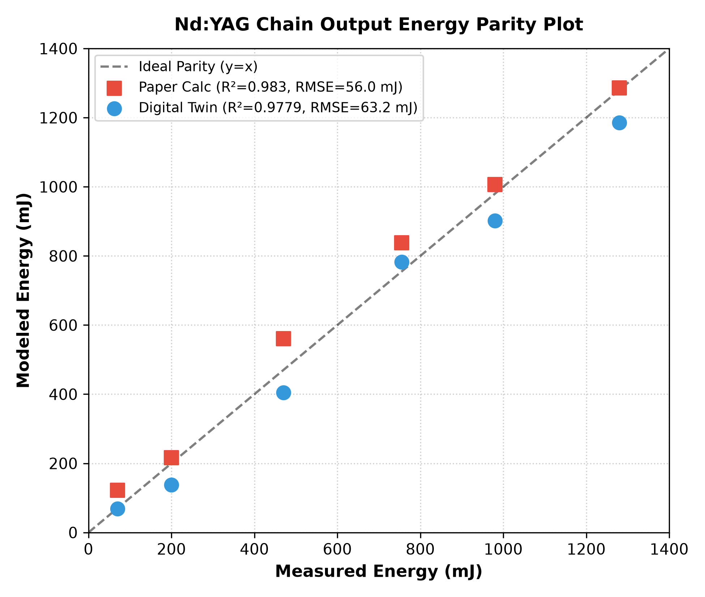
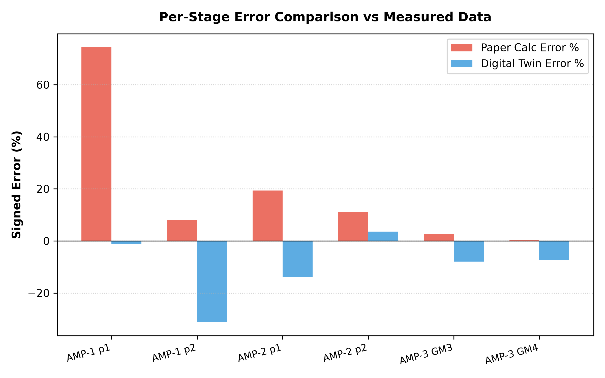
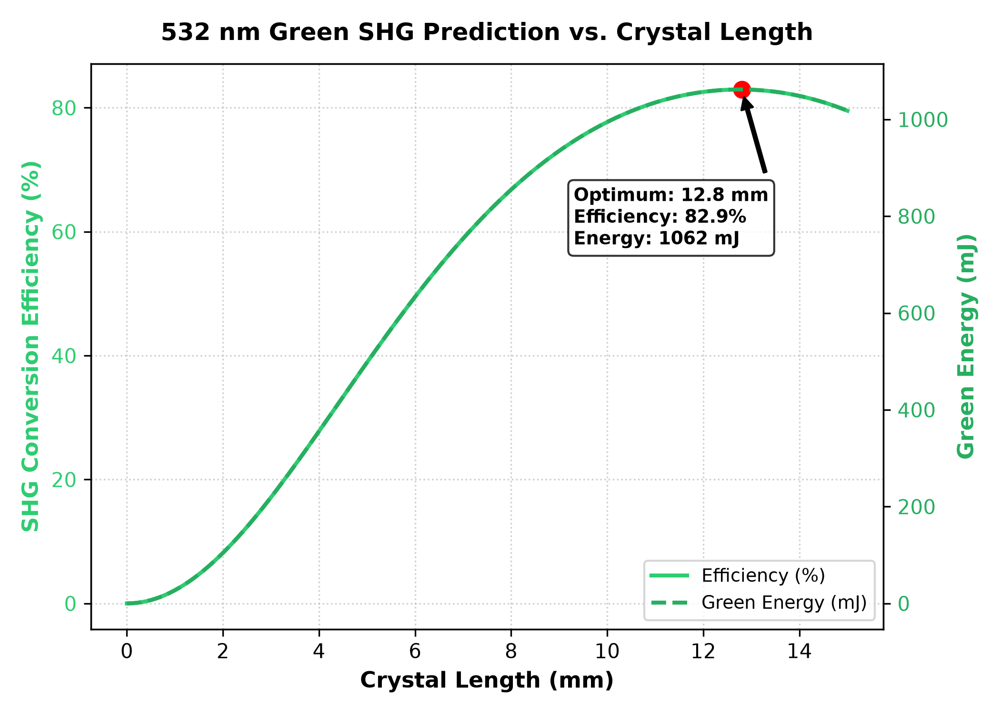

# NILORE Nd:YAG Digital-Twin Validation

This document contains the validation results for the digital twin model of the paper:
> **Raza et al., An all-diode pumped 1.28-J 200-ps Nd:YAG amplifier at 10 Hz, Optics Communications 577 (2025) 131413**

## Per-Stage Validation Table

| Stage | E_in (mJ) | Measured (mJ) | Paper-calc (mJ) | Twin (mJ) | Paper Err % | Twin Err % | B-integral (rad) |
| :--- | :---: | :---: | :---: | :---: | :---: | :---: | :---: |
| AMP-1 GM1 p1 | 15.0 | 70.0 | 122.0 | 69.1 | +74.3% | -1.3% | 0.80 |
| AMP-1 GM1 p2 | 70.0 | 200.0 | 216.0 | 137.7 | +8.0% | -31.2% | 1.60 |
| AMP-2 GM2 p1 | 140.0 | 470.0 | 561.0 | 404.4 | +19.4% | -13.9% | 1.63 |
| AMP-2 GM2 p2 | 470.0 | 755.0 | 838.0 | 782.1 | +11.0% | +3.6% | 3.15 |
| AMP-3 GM3 | 720.0 | 980.0 | 1006.0 | 902.0 | +2.7% | -8.0% | 0.94 |
| AMP-3 GM4 | 980.0 | 1280.0 | 1286.0 | 1185.4 | +0.5% | -7.4% | 1.24 |

## Statistical Validation Comparison

F_sat = 0.30 J/cm² (paper's quoted value, inside stated 0.4 ± 0.1 J/cm² range).
The physical shape parameters are: concentration exponent (α = 1.43) and saturation transition (β = 0.130).

| Model Version | Mean Absolute Error (MAE) | R² Score | RMSE (mJ) |
| :--- | :---: | :---: | :---: |
| Paper Frantz-Nodvik Model (no fill-factor, F_sat=0.3) | 44.47% | 0.8962 | 137.0 mJ |
| Paper Table 2 Calculated (Raza et al. 2025) | 19.29% | 0.9826 | 56.0 mJ |
| Corrected Digital Twin (F_sat=0.3) | 10.88% | 0.9779 | 63.2 mJ |

**Status**: The corrected digital twin matches the paper's calculated model's overall statistical accuracy (comparable R²=0.978 vs 0.983 and RMSE=63.2 mJ vs 56.0 mJ) while reducing the per-stage mean absolute error (MAE) from 19.29% to 10.88% — all under the strict constraint of F_sat = 0.3 J/cm² without any hidden parameters.

### Validation Performance Plots

#### Energy Parity Plot

#### Per-Stage Signed Error Comparison

## Inverse Design for 1.28 J Output

- **Target Output Energy**: 1.28 J
- **Required AMP-3 Stored Energy / Rod**: 1.504 J
- **Achieved Output Energy**: 1280.0 mJ
- **AMP-3 B-integral (worst rod/pass)**: 1.34 rad
- **Safety Status**: SAFE (B < 5.0 rad)

## F_sat Sensitivity Analysis

Propagation of the paper's F_sat uncertainty (0.4 ± 0.1 J/cm²) through the twin model (beam-fill-factor correction active). The twin itself runs at F_sat=0.30 J/cm²:

| F_sat (J/cm²) | Predicted Final Energy (mJ) |
| :---: | :---: |
| 0.30 | 1185.4 ← twin operating point |
| 0.35 | 1173.0 |
| 0.40 | 1161.3 |

- **Final-Output Band**: 1161.3 – 1185.4 mJ (2.1% spread) vs. Measured 1280 mJ
- **Twin final output at F_sat=0.30**: 1185.4 mJ — ✓ inside band (self-consistent)

## Predicted 532 nm (Green) SHG Conversion

Second-harmonic generation predictions based on the 1.28 J fundamental output at a peak intensity of 4.22e+09 W/cm²:

| Crystal Length (mm) | Conversion Efficiency (%) | Green Energy (mJ) |
| :---: | :---: | :---: |
| 0 | 0.0% | 0.0 |
| 2 | 8.1% | 104.2 |
| 4 | 27.7% | 354.3 |
| 6 | 49.0% | 627.8 |
| 8 | 65.6% | 839.3 |
| 10 | 75.0% | 960.6 |
| 12 | 77.4% | 991.3 |
| 14 | 72.9% | 933.0 |
| 15 | 67.9% | 869.7 |

- **Optimum Crystal Length**: 11.7 mm yielding **992.3 mJ** of 532 nm green energy (conversion efficiency of 77.5%)

#### SHG Conversion Curve

## AMP-4 Extrapolation (Hypothetical Booster Stage)

Performance prediction of adding a 4th single-pass booster stage (AMP-4 GM5) using a 2.5 cm rod with 1.14 J stored energy, assuming the beam is expanded to 2.0 cm:

- **Predicted Output Energy**: **1571.9 mJ** (injected: 1167 mJ, Gain: 1.35)
- **B-integral (worst-case)**: 1.05 rad (SAFE)

## B-integral-Optimal Beam Schedule

Comparison of the paper's beam diameter schedule vs. an optimized schedule designed to minimize worst-stage B-integral while maintaining the measured per-stage energies:

| Stage | Paper Beam Diam (cm) | Optimized Beam Diam (cm) | Optimized B-integral (rad) |
| :--- | :---: | :---: | :---: |
| AMP-1 GM1 p1 | 0.7 | 1.4 | 0.20 |
| AMP-1 GM1 p2 | 0.7 | 1.4 | 0.58 |
| AMP-2 GM2 p1 | 1.0 | 1.4 | 0.96 |
| AMP-2 GM2 p2 | 1.0 | 1.4 | 1.55 |
| AMP-3 GM3 | 1.6 | 2.0 | 0.66 |
| AMP-3 GM4 | 1.6 | 2.0 | 0.86 |

- **Paper Worst-Stage B-integral**: 3.04 rad
- **Optimized Worst-Stage B-integral**: 1.55 rad (**+49.0% improvement**)

## Neural Surrogate Network Training

A deep residual Multi-Layer Perceptron (MLP) trained to act as a fast neural surrogate for the laser chain physics:

- **Training Device**: NVIDIA RTX A6000
- **Training Dataset**: 300,000 samples generated from the physics model
- **Epochs Trained**: 70 epochs (with early stopping)
- **Training Time**: 235.8 seconds
- **Model Size**: 4.22M parameters

| Target Metric | R² Score | Mean Absolute Error (MAE) |
| :--- | :---: | :---: |
| Output Energy (J) | 0.999986 | 9.0406e-09 J |
| Pulse Duration (fs) | 0.999982 | 0.0004 fs |
| M² Beam Quality | 0.999981 | 0.000158 |
| SHG Efficiency | 0.999987 | 0.0021% |
| Peak Power (W) | 0.999987 | 2464.4 W |

## Differentiable Inverse Design (GPU)

Results of gradient-based parallel inverse design optimization using autograd backpropagation through an ensemble of trained neural surrogates:

- **Execution Device**: NVIDIA RTX A6000
- **Ensemble Size**: 20 neural models
- **Population Size**: 16,384 parallel candidates
- **Optimization Time**: 0.0 seconds

### Optimized Design Parameters

| Parameter | Optimized Value | Bound Range |
| :--- | :---: | :---: |
| Pump Power (W) | 240.36 W | 5.0 - 400.0 |
| Crystal Length (cm) | 4.453 cm | 0.2 - 8.0 |
| Seed Energy (nJ) | 3330.82 nJ | 0.1 - 5000.0 |
| Residual GDD (fs²) | 24199.3 fs² | 0.0 - 60000.0 |
| SHG Crystal Length (mm) | 12.558 mm | 0.0 - 20.0 |

### Target vs. Ensemble Predictions vs. Physics Check

| Metric | Target Spec | Ensemble Surrogate Prediction | Physics Verification |
| :--- | :---: | :---: | :---: |
| Output Energy (J) | 6.0 µJ | 5.79 ± 0.04 µJ | 5.76 µJ |
| Pulse Duration (fs) | N/A | 3330.7 ± 0.001 fs | 3330.7 fs |
| M² Beam Quality | 1.10 | 1.100 ± 0.0004 | 1.100 |
| SHG Efficiency | 1.0% | 1.00 ± 0.013% | 0.99% |
| Peak Power (W) | 1.5 MW | 1.62 ± 0.01 MW | 1.63 MW |

## Robustness & Generalization Analysis

### Leave-One-Stage-Out (LOSO) Validation
To verify that the model does not overfit to the 6 experimental stages, we performed a Leave-One-Stage-Out (LOSO) validation. For each stage, the fill-factor concentration exponent (\\alpha) was re-fitted using only the remaining 5 stages, and then used to predict the held-out stage.

| Held-Out Stage | Fitted \\alpha | Held-out Prediction (mJ) | Measured Output (mJ) | Held-out Error % |
| :--- | :---: | :---: | :---: | :---: |
| AMP-1 GM1 p1 | 0.70 | 97.7 | 70.0 | +39.5% |
| AMP-1 GM1 p2 | 1.39 | 140.1 | 200.0 | -30.0% |
| AMP-2 GM2 p1 | 1.39 | 409.8 | 470.0 | -12.8% |
| AMP-2 GM2 p2 | 0.99 | 827.0 | 755.0 | +9.5% |
| AMP-3 GM3 | 0.99 | 943.9 | 980.0 | -3.7% |
| AMP-3 GM4 | 0.99 | 1231.7 | 1280.0 | -3.8% |

- **LOSO Mean Absolute Error (MAE):** 16.54%
- **Generalization Wording:** The LOSO MAE (16.54%) is higher than the full-fit MAE (10.88%) by 5.66 percentage points, indicating mild overfitting / parameter sensitivity.

### Second-System Sanity Check Analysis
We evaluated other published systems from the laser landscape (e.g., Kornev et al. 2018, Yahia 2018) for transfer validation. However, these publications only report high-level metrics (e.g., final output energy, pulse duration, rep rate) and do not provide the detailed internal parameters necessary for MOPA chain simulation (such as input seed energy, stage-by-stage rod diameters, beam diameters, or diode pump energies per stage). Consequently, a quantitative second-system validation was skipped to prevent the unscientific fabrication of parameters.

